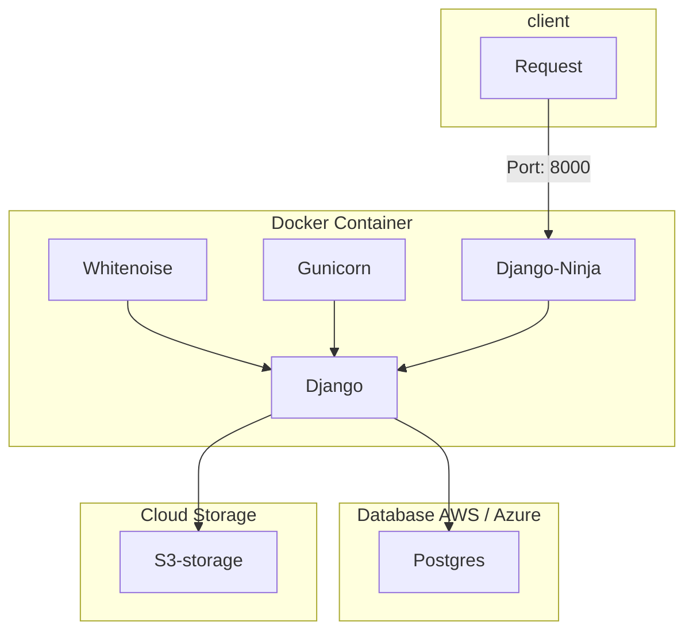
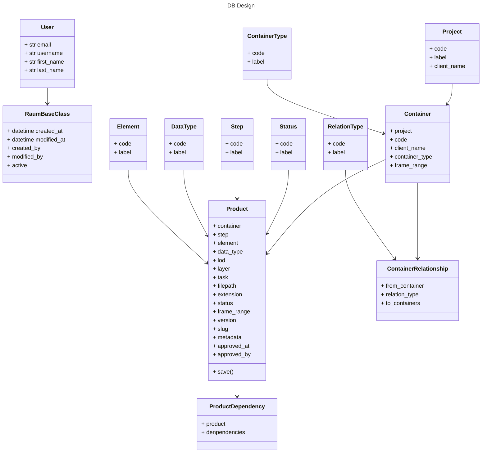

# Technology Stack

```mermaid
    flowchart TD
        subgraph Docker Container
            Whitenoise --> Django
            Gunicorn --> Django
            Django-Ninja -->Django
        end
        subgraph Database AWS / Azure
            Django --> Postgres
        end
        subgraph Cloud Storage
            Django --> S3-storage
        end

        subgraph client
            Request -- Port: 8000 --> Django-Ninja
        end
```

# Database ORM

```mermaid
---
title: DB Design
---
classDiagram
    class User{
        + str email
        + str username
        + str first_name
        + str last_name
    }
    class RaumBaseClass{
        + datetime created_at
        + datetime modified_at
        + created_by
        + modified_by
        + active
    }
    class Project{
        + code
        + label
        + client_name
    }
    class Container{
        + project
        + code
        + client_name
        + container_type
        + frame_range
    }
    class Product{
        + container
        + step
        + element
        + data_type
        + lod
        + layer
        + task
        + filepath
        + extension
        + status
        + frame_range
        + version
        + slug
        + metadata
        + approved_at
        + approved_by
        + save()
    }
    class ContainerRelationship{
        + from_container
        + relation_type
        + to_containers
    }
    class ProductDependency{
        + product
        + denpendencies
    }
    class Status{
        + code
        + label
    }
    class Step{
        + code
        + label
    }
    class Element{
        + code
        + label
    }
    class DataType{
        + code
        + label
    }
    class RelationType{
        + code
        + label
    }
    class ContainerType{
        + code
        + label
    }
    Project --> Container
    Container --> Product
    Container --> ContainerRelationship
    ContainerType --> Container
    Status --> Product
    Step --> Product
    DataType --> Product
    Element --> Product
    RelationType --> ContainerRelationship
    Product --> ProductDependency
    User --> RaumBaseClass
```